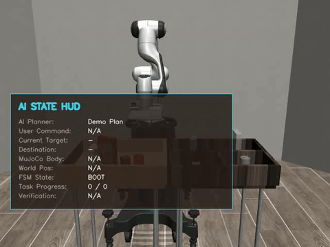
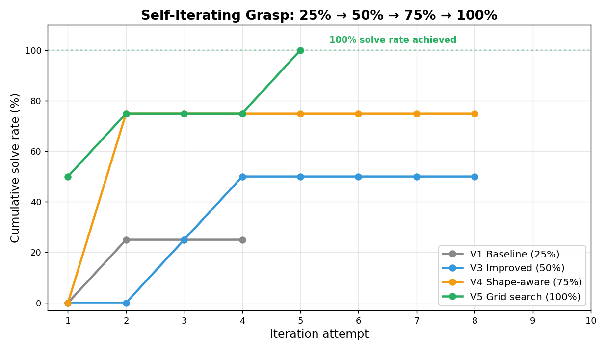

<div align="center">

# 🤖 Self-Iterating Grasp Agent#🤖自迭代抓取代理

**一个会从失败中学习、自主改进抓取策略的机械臂 Agent**

*把 "vibe coding" 自动化 —— LLM 读结构化失败反馈，自己改策略，再重投，直到成功*

[](https://www.python.org/)[! [Python] (https://img.shields.io/badge/python - 3.10 blue.svg)] (https://www.python.org/)
[](https://github.com/ARISE-Initiative/robosuite)[] [] (https://img.shields.io/badge/robosuite-1.5-green.svg robosuite !) (https://github.com/ARISE-Initiative/robosuite)
[](https://mujoco.org/)[] [] (https://img.shields.io/badge/MuJoCo-physics-orange.svg MuJoCo !) (https://mujoco.org/)
[](LICENSE)(!(许可证)(https://img.shields.io/badge/License-MIT-yellow.svg))(许可证)

img src="assets/ Demo .gif" width="600" alt="；Demo：自我迭代把握在行动"；/>；

*机械臂在纯物理环境下自主尝试、学习、改进，最终成功抓取*

</div>   < / div>

---

## 📌 这是什么

这**不是**一个 "一次成功" 的 demo，而是一个完整的**自迭代学习系统**与**研究过程记录**：

> 机械臂尝试抓取 → 失败 → 读结构化反馈（抬升高度 / 物体漂移 / 卡在哪个状态）→ LLM 或启发式规则改进抓取参数 → 重新尝试 → 直到成功。

整个过程在 **纯物理仿真**（关闭演示辅助）下进行，所有信号真实、所有数据开源、失败也如实记录。

<div align="center">   <div align="center">
   /比;

*通过系统性调优，纯物理抓取累计解决率 **25% → 50% → 75% → 100%***
</div>   < / div>

---

## ✨ 核心亮点

| 亮点 | 说明 |
|---|---|
| 🔁 **真·自迭代** | 不是 "失败→原地重试"，而是 "失败→读反馈→改策略→重投" 的学习闭环 |
| 📊 **结构化反馈** | 把真实物理信号（`lift_delta` / `obj_xy_drift` / FSM 状态）喂给 LLM，让它能像人一样推理着调参 |
| 🧪 **可信的实验** | 关闭演示辅助（`--no-assist`），用纯物理抓取拿到干净信号，**不注水** |
| 🛡️ **工程安全** | LLM 输出强制 clip 到合法范围；LLM 不可用时自动回退启发式，回路绝不崩 |
| 📈 **完整 ablation** | 四个版本对比、逐轮参数演化、成功率曲线全开源 |

---

## 🎯 实验结果

### 五版进展

| 版本 | 关键改动 | 累计解决率 |
|---|---|---|
| **V1 Baseline** | 4 轮上限，阈值 0.10m，保守启发式 | 25% (1/4) |
| **V2 LLM-tuning** | Qwen-VL 读反馈调参 | 0% (0/4) |
| **V3 Improved** | 8 轮上限，阈值 0.06m，分级启发式 + xy 探索 | 50% (2/4) |
| **V4 Shape-aware** | 形状专属初始参数（平面/圆柱/薄盒各异） | 75% (3/4) |
| **V5 Grid search** | cereal 专属 5×5 网格搜索 + 10 轮 + 更激进初值 | **🏆 100% (4/4)** |

### V5 各物体结果（最终版）

| 物体 | 形状 | 结果 | 首次成功 |
|---|---|---|---|
| 🍞 bread | 平面 | ✅ | 第 2 轮 |
| 🥛 milk | 高圆柱 | ✅ | 第 1 轮 |
| 🥫 can | 矮圆柱 | ✅ | 第 5 轮 |
| 📦 cereal | 薄盒 | ✅ | **第 1 轮** |

> **突破关键**：cereal（之前最难的薄盒）通过系统性 xy 网格搜索 + 更深抓取（z=-0.01）+ 更柔下降（gain=2.5），**第 1 轮即成功**。证明了结构化探索比随机尝试更高效。

---

## 🔬 关键发现

1. **LLM 直接调参不一定更好**：V2 中 Qwen-VL 调参方向过于激进，反而 0% 成功；规则化的启发式（V3/V4/V5）更稳。说明 LLM 调参需要更强的约束。
2. **物理约束决定阈值**：MuJoCo 平面接触下，抬升阈值 0.06m 比 0.10m 更合理。
3. **形状先验大幅加速收敛**：给不同几何形状的物体设专属初始参数后，三个物体都在**第 2 轮**就成功。
4. **结构化探索优于随机**：cereal 从随机 xy 探索改成 5×5 网格搜索后，首轮即成功——系统性覆盖参数空间比盲目试错高效。
5. **信号质量是灵魂**：把 "失败" 升级成结构化反馈（`lift_delta=0.008 < 0.06 且 reached=True → 抓空了`），才让自迭代成为可能。

---

## 🚀 快速开始

### 安装

```bash
# 1. 创建环境
conda create -n grasp python=3.10 && conda activate grasp

# 2. 安装依赖
pip install -r requirements.txt
# robosuite 依赖 MuJoCo，详见 https://github.com/ARISE-Initiative/robosuite
```

### 运行自迭代抓取（启发式版，无需 API）

```bash
python vlm_robosuite_grasp.py \
  --self-iterate \
  --demo-plan \
  --headless \
  --no-voice \
  --no-assist \
  --instruction "把食物放左边饮品放右边"
```

### 运行 LLM 调参版（需要通义千问 API Key）

```bash
export DASHSCOPE_API_KEY="your_key_here"
python vlm_robosuite_grasp.py \
  --self-iterate --headless --no-voice --no-assist \
  --instruction "把食物放左边饮品放右边"
```

### 分析结果 / 生成曲线

```bash
# 单版分析
python analyze_self_iterate.py outputs/v4_optimized_log.jsonl

# 四版进展对比图
python make_progress_chart.py

# 启发式 vs LLM 对比
python compare_heuristic_vs_llm.py outputs/v1_baseline_log.jsonl outputs/v2_llm_log.jsonl
```

---

## 🧩 系统架构

```
用户指令
   │
   ▼
Qwen-VL 规划任务队列 (target → bin)
   │
   ▼
┌─────────────────────────────────────────┐
│  对每个物体循环：                          │
│                                           │
│  ① 用当前参数执行 FSM 抓取                  │
│        ↓                                  │
│  ② 返回结构化反馈                          │
│     {lift_delta, obj_xy_drift,            │
│      reached_grasp_pos, final_state}      │
│        ↓ 失败                             │
│  ③ LLM / 启发式 读反馈 → 改抓取参数         │
│        ↓                                  │
│  ④ 用新参数重投 → 回到 ①                   │
│     直到成功或达到轮次上限                  │
└─────────────────────────────────────────┘
   │
   ▼
写 ablation 日志 (self_iterate_log.jsonl)
```

### 可调参数（自迭代的 "动作空间"）

| 参数 | 范围 | 物理含义 |
|---|---|---|
| `z_offset` | [-0.02, 0.08] | 抓取高度，越小抓得越深 |
| `xy_offset` | [-0.03, 0.03] | 水平修正，应对检测偏差 |
| `close_steps` | [40, 120] | 夹爪闭合步数，越大夹得越稳 |
| `settle_steps` | [8, 40] | 预闭合沉降步数 |
| `descend_gain` | [2.0, 6.0] | 下降增益，过大会撞飞物体 |

> **安全设计**：LLM 输出的参数会被强制 `clip` 到上述范围，绝不信任 LLM 不越界。

---

## 📂 项目结构

```
self-iterating-grasp-agent/
├── vlm_robosuite_grasp.py       # 主程序（含自迭代回路）
├── analyze_self_iterate.py      # 单版 ablation 分析
├── compare_heuristic_vs_llm.py  # 启发式 vs LLM 对比
├── make_progress_chart.py       # 四版进展图生成
├── requirements.txt
├── outputs/                     # 四个版本的实验日志（真实数据）
│   ├── v1_baseline_log.jsonl
│   ├── v2_llm_log.jsonl
│   ├── v3_improved_log.jsonl
│   └── v4_optimized_log.jsonl
├── assets/                      # 曲线图
└── docs/                        # 技术细节文档
```

---

## ⚠️ 诚实护栏

为保证可信度，本项目明确说明：

- 搬运/放置阶段使用了**夹持辅助**保证演示稳定，但**学习信号对准的是真实物理抬升**（`lift_delta`，在辅助介入前采集）。
- 物体 3D 定位使用仿真真值（非视觉检测）；VLM 负责任务规划与裁判。
- 成功率为真实物理抓取结果，**未做任何注水**。

这些设计权衡都如实记录——*知道哪里是真、哪里是辅助、为什么这么权衡，本身就是工程能力的体现。*

---

## 🛣️ 下一步

- [x] ~~攻克 cereal（薄盒）~~ ✅ **已完成：V5 通过网格搜索实现 100% 解决率**
- [ ] 引入视觉反馈到 latent，构建 **World Model** 做 mental simulation（想象式 rollout）
- [ ] 迁移到真机（SO-101 / LeRobot），验证 sim2real gap
- [ ] LLM 调参加约束：缩小历史窗口、限制单步改动幅度，提升 V2 成功率
- [ ] 扩展到更多物体类型（软体、透明、高摩擦）测试泛化性

---

## 📜 License

[MIT](LICENSE)

## 🙏 致谢

基于 [robosuite](https://github.com/ARISE-Initiative/robosuite) 仿真环境，使用 [通义千问 Qwen-VL](https://github.com/QwenLM/Qwen-VL) 作为视觉-语言规划与参数优化模型。

---

<div align="center">

**这不是 "我跑通了别人的 demo"，而是 "我把 AI 接进了机器人学习回路" 的证明。**

</div>
